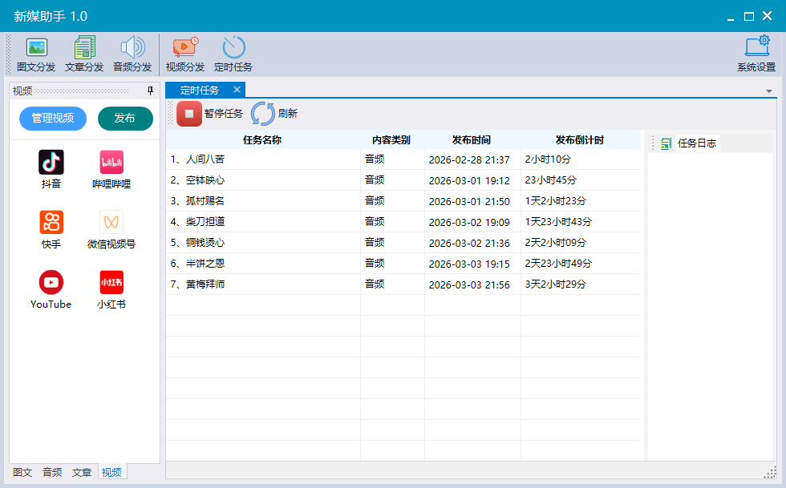

# 新媒助手（SmartMedia）

## 📌 项目概述

类似易媒助手/蚁小二的自媒体分发软件(但本软件支持国外平台)，支持视频，音频，图文，文章一键发布到国内外主流自媒体平台(如抖音、快手、视频号、B站、小红书、头条号、微信公众号、喜马拉雅、YouTube 、TikTok 、 Instagram、 Facebook 等)。提供定时发布，批量导入，发布规则热更新，桌面软件，下载即用。

在实际开发中，我会优先采用更稳定的方案：
- **如果平台提供官方 API**（如微信公众号、YouTube 等），我会直接通过 API 接入，确保发布流程稳定可靠。
- **如果平台没有开放 API**，我会通过模拟真人操作的方式实现发布功能，并持续优化其稳定性。
 

---

## 🚀 快速开始

本软件是一款基于 .NET 开发的桌面应用，目前仅支持 Windows 系统。它以独立的可执行文件（.exe）形式提供，无需复杂安装，真正做到开箱即用。

**运行条件与注意事项**：
- 若首次运行时提示缺少 .NET 框架，请根据指引下载并安装对应版本。
 

### 📥 下载与安装
1.  **下载软件**：点击[此处](https://github.com/yibo7/SmartMedia/releases)获取最新版本压缩包。选择Assets中的SmartMedia-win64.zip下载
2.  **解压文件**：将下载的压缩包解压。
3.  **启动程序**：进入解压后的文件夹，双击运行 `SmartMedia.exe`。
4.  **安装运行环境**（如需要）：若首次运行提示缺少 .NET 环境，请按界面指引完成安装。
5.  **创建快捷方式**（可选）：右键点击 `SmartMedia.exe`，选择“发送到 → 桌面快捷方式”，方便日后快速启动。

### ❓ 使用教程

点击[这里查看使用教程](/doc/UserGuide.md)

 
 
 
---

## 🎨 支持内容类型
- 视频
- 音频
- 图文
- 文章(长文章)

## ✅ 核心功能状态概览

- **一键发布**：每条任务可以配置无限个发布平台，一键发布内容至多个平台。
- **批量发布**：无限批量发布内容至多个平台。
- **定时发布**：每一条任务都可以指定发布时间，定时发布内容至多个平台。
- **批量导入**：按软件导入规范生成数据包后，可一键导入任务。
- **账号管理**：
  - [x] 统一管理多个主流平台账号
  - [x] 支持无限添加账号

---

## 📋 平台支持清单

### 一、短视频/视频平台

#### ✅ 已完成接入
- 抖音
- 快手
- 微信视频号
- Bilibili (B站)
- 小红书 (视频笔记)
- YouTube **（基于官方API，管理更稳定）**
- X(Twitter)**（基于官方API，自2026年2月开始需要充值积分才能使用）**
- Facebook **（基于官方API，管理更稳定）**

#### 🔄 待接入/优化
- Instagram   
- TikTok (国际版)

---

### 二、图文/文章平台

#### ✅ 已完成接入
- 微信公众号 **（基于官方API，管理更稳定）**
- 小红书 (图文笔记)
- 头条号(微头条)
- X(Twitter)**（基于官方API，自2026年2月开始需要充值积分才能使用）**
- Facebook **（基于官方API，管理更稳定）**

#### 🔄 待接入/优化
- 今日头条
- 新浪微博
- 知乎

---

### 三、音频/听书平台

#### ✅ 已完成接入
- 喜马拉雅

#### 🔄 待接入/优化
- 懒人听书
- 蜻蜓FM

 

---

## ❓ 常见问题与支持

- **技术问题**：请优先在项目的 [GitHub Issues](请替换为实际的GitHub Issues链接) 页面提交，我们将尽快回复。
- **使用反馈**：欢迎提出功能建议或改进想法。
- **其他咨询**：如需其他帮助，可通过GitHub项目主页联系我们。

---

## 🤝 贡献与支持

我们欢迎并感谢所有形式的贡献，包括但不限于：
- 提交代码改进或新功能
- 报告Bug或提出建议
- 完善使用文档
- 分享使用经验

感谢您对新媒助手（SmartMedia）的关注与支持！