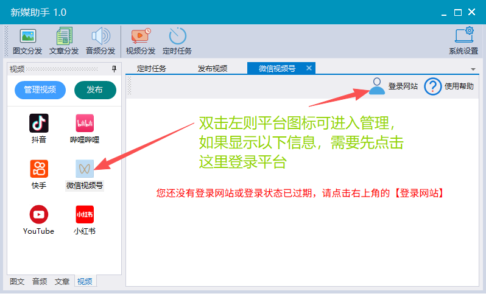
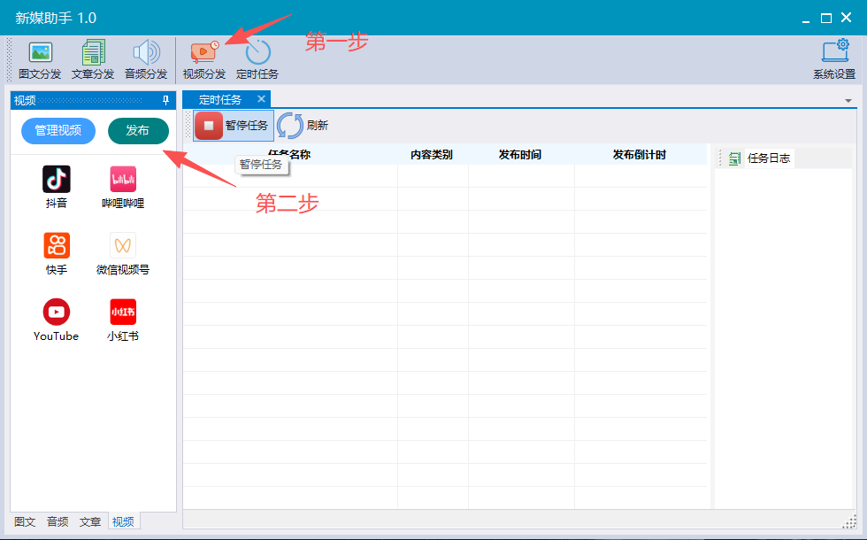
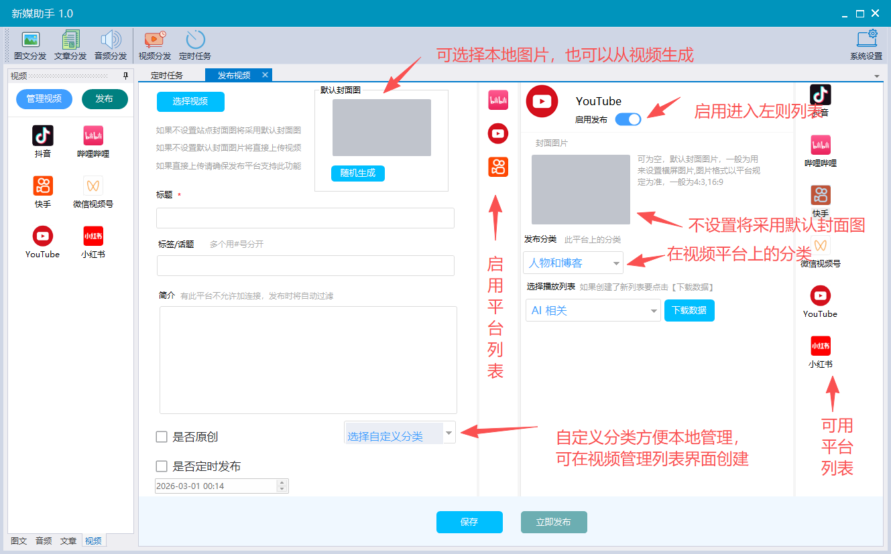
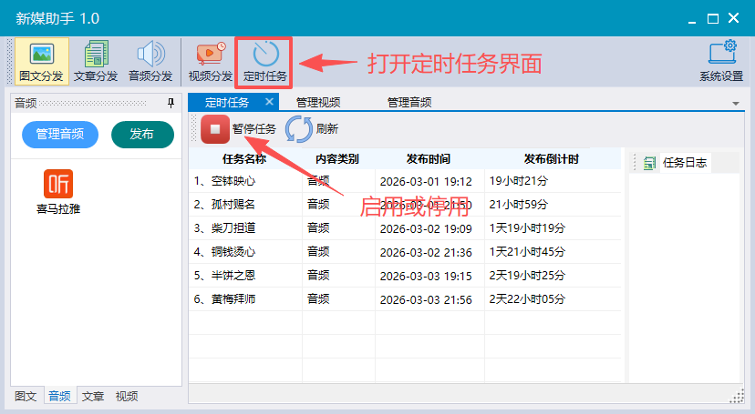
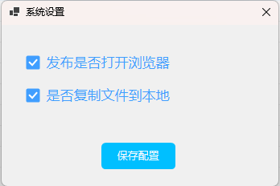

### 一. 登录平台
要发布内容到自媒体平台，得先登录平台。
登录平台最好使用扫码方式。
目前微信视频号的登录状态只能保留一天，其他每天使用可以长期保存。

### 二. 发布内容
以发布视频为例：
 - 1.点击视频分发
 - 2.点击左则的发布按钮可以进入发布页面

发布页面说明：

### 三. 管理内容

点击左则的【管理视频/图文/文章/音频】即可进入相应的管理界面。

功能介绍：

### 四. 定时发布
软件默认打开会进入定时任务界面。
你可以停用或启用定时任务.

### 五.系统设置
1. 设置发布时是否打开浏览器(如果是API发布这项不起作用)
2. 添加或导入任务时，是否将资源(视频/音频/图片/字幕)同步到本地目录
    同步资源方便你后期复制软件到其他机器上使用。

